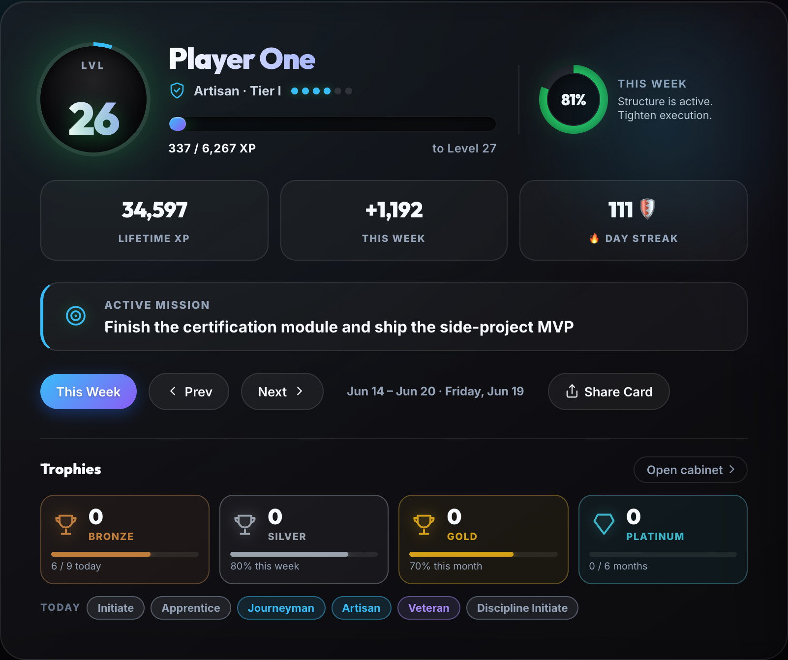
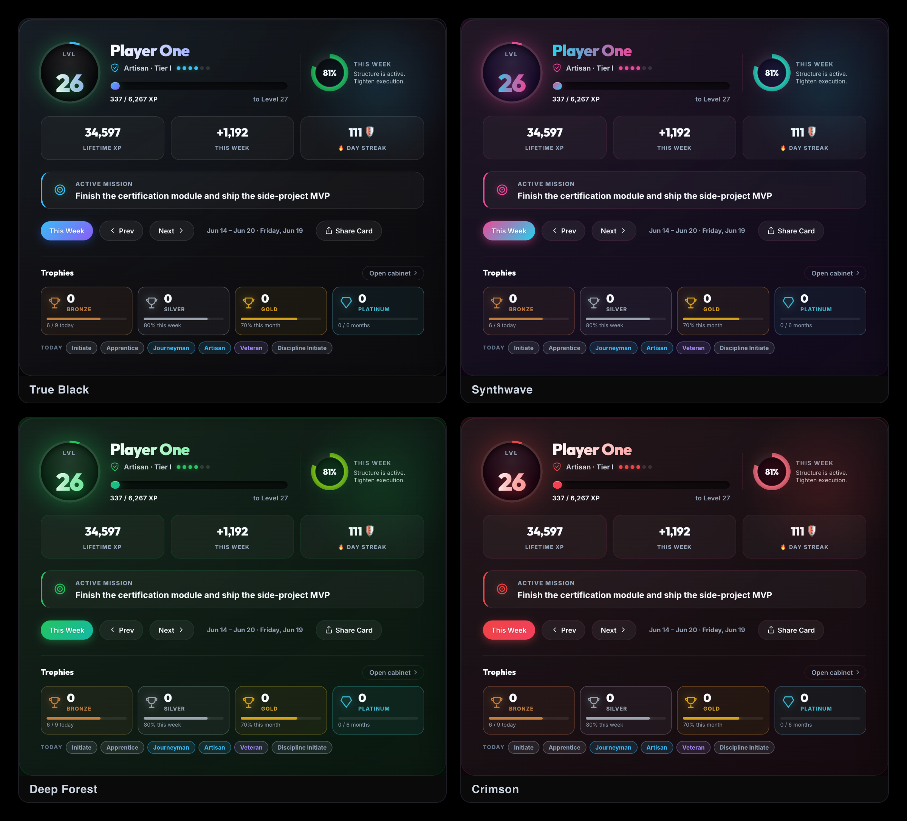
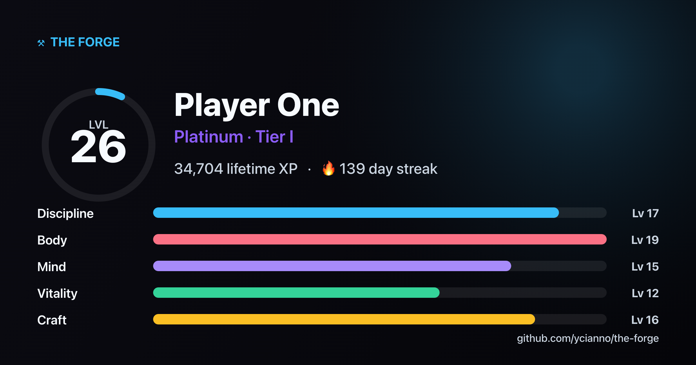

# The Forge

<div align="center">
  
  <h3>Turn your real life into an RPG.</h3>
  <p><strong>A self-hosted, single-user habit tracker that gamifies your goals</strong> — XP, levels, life attributes, daily quests, streaks, badges, and a weekly boss. No accounts, no cloud, no tracking. Your data lives in one SQLite file on your own machine.</p>
  <p>
    
    
    
    
  </p>
</div>

---

## Why The Forge?

Most habit trackers are a flat list of checkboxes — easy to ignore, easy to abandon. The Forge wraps your daily discipline in a game loop so that doing the boring, important things feels rewarding:

- Every checked task awards **XP** with a sound, a particle pop, and a combo meter.
- XP flows into a persistent **level + rank** and five **life attributes** you can watch grow on a radar chart.
- A rotating **weekly boss** gives you something to beat each week; falling behind on its "weak" attribute lets it survive.
- **Streaks**, **badges**, and **milestones** keep the dopamine coming.

It's opinionated and built for one person: you. Self-host it, set a password, and own your data.

## Features

| | |
|---|---|
| 🎮 **Game engine** | Lifetime XP, leveling curve, Bronze→Master ranks, and 5 independently-leveling attributes (Discipline, Body, Mind, Vitality, Craft) — all derived from the checks you already make. |
| ✅ **Daily quests** | A per-day checklist where each task awards XP. Combos, haptics, and a "Day Cleared" celebration when you finish the day. |
| 🔥 **Streaks & freeze** | Daily and weekly streaks with milestone rewards (7 / 30 / 100 / 365 days) and a configurable "freeze" grace day so one bad day doesn't reset everything. |
| 🏆 **Badges & trophies** | Auto-unlocking achievement badges across four rarities, plus a manual trophy case for real-world wins (certifications, PRs, goals). |
| 👹 **Weekly boss** | A deterministic boss each week whose HP drains as you complete your week — with double damage to its weak attribute. Defeat it for a badge and a victory celebration. |
| ⏱️ **Focus timer** | A built-in Pomodoro/focus timer that logs elapsed hours straight into your study/project goals. |
| 📊 **Analytics** | Weekly completion & XP trends, by-weekday breakdowns, and your most-skipped quests. |
| 📅 **Goal tracking** | Certifications & study goals with deadline countdowns and pacing, weekly project-output tracking, diet/protein checklists, and a structured weekly review. |
| 🎨 **10 themes** | A full palette of distinct dark themes (True Black, Crimson, Deep Forest, Synthwave, Nord, Carbon, and more). |
| 📱 **PWA + push** | Installable on iOS/Android, works offline, and supports optional web-push reminders. |
| 🪪 **Shareable card** | Export your level, rank, and attributes as a PNG to share — and load **sample data** in one click so a fresh install looks alive. |
| 🤖 **Optional Discord agent** | "Hermes" — a local-AI companion (via [Ollama](https://ollama.com)) that reads your progress and nudges you on Discord. See [`agent/`](agent/). |

> Everything (goals, quests, diet, projects, review prompts, difficulty) is editable in-app — no code changes required.

## Screenshots

<div align="center">
  
  <br/><br/>
  
  <br/><br/>
  
</div>

## Quick start (Docker)

The Forge is designed to run on your own hardware — a Raspberry Pi, a Proxmox VM, a NAS, or any VPS.

```bash
git clone https://github.com/ycianno/the-forge.git
cd the-forge

# Set a password before you start (this is the only thing protecting your dashboard)
cp .env.example .env
#   then edit .env and change APP_PASSWORD

docker compose up -d
```

Open **http://localhost:3007**, log in with your password, and start forging. Your database is persisted to `./data/database.sqlite`. On first launch you can **load sample data** to see a populated dashboard, or start fresh.

> `docker-compose.yml` reads `APP_PASSWORD` from your `.env` file. If you prefer, you can also set it directly in the compose file.

### Fastest: prebuilt image (no build)

A multi-arch image (amd64 + arm64, so it runs on a Raspberry Pi too) is published to GitHub Container Registry:

```bash
docker run -d --name forge \
  -p 3007:3007 \
  -e APP_PASSWORD=your-password \
  -v "$PWD/data:/app/data" \
  ghcr.io/ycianno/the-forge:latest
```

Or in `docker-compose.yml`, comment out `build: .` and uncomment the `image:` line.

### Without Docker

```bash
npm install
APP_PASSWORD=your-password npm start
# → http://localhost:3007
```

Requires Node.js 20+. `better-sqlite3` compiles a native module, so you'll need build tools (`python3`, `make`, `g++`) on first install.

## Configuration

| Variable | Default | Description |
|---|---|---|
| `APP_PASSWORD` | `changeme` | **Change this.** The password for the single user. |
| `PORT` | `3007` | Port the server listens on. |
| `DB_PATH` | `/app/data/database.sqlite` | Where the SQLite database lives. |
| `SESSION_SECRET` | *(auto-generated)* | Secret used to sign the session cookie. A random one is generated and persisted on first run; set this only if you want to control it explicitly. |

Web-push **VAPID keys are generated automatically** on first run and stored in the database — you don't need to configure them.

## Backups

- **From the UI:** Settings → Data → *Export Full Backup* writes a JSON snapshot you can re-import later.
- **Raw database:** copy `data/database.sqlite` out of the mounted volume. The included [`backup.sh`](backup.sh) shows a simple scheduled-snapshot approach.

## Security

The Forge is a **single-user app with a single shared password** — it is intentionally simple, not a multi-tenant platform. Treat it accordingly:

- **Always change `APP_PASSWORD`** before exposing it anywhere.
- **Don't put it directly on the public internet.** Run it behind a reverse proxy with HTTPS, or — recommended — a zero-trust tunnel (e.g. Cloudflare Tunnel / Tailscale) so only you can reach it.
- The session cookie is `httpOnly` and signed with a persisted random secret.

## Tech stack

- **Frontend:** Vanilla HTML/CSS/JS — no framework, no build step. Themed entirely with CSS custom properties.
- **Backend:** Node.js + Express.
- **Database:** SQLite via `better-sqlite3`.
- **Auth:** Signed, `httpOnly` session cookie.
- **Packaging:** Docker + Docker Compose.

## Contributing

Issues and PRs are welcome — see [CONTRIBUTING.md](CONTRIBUTING.md). The Forge is opinionated by design, so features that keep it simple and single-user are the easiest to land.

## License

[MIT](LICENSE) © 2026 YZEE Labs
